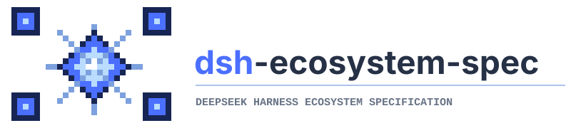

  

  
  
  
  
  

# dsh-ecosystem-spec

> **DSH Community Ecosystem Interoperability Specification**  
> 社区插件互操作规范实验库

※本文档正在修订中，在这句话被删除之前，请以/old的全量备份为准

## 这是什么项目？

这是由[dsh-TUI](https://github.com/ccch1mneyyy/dsh-TUI)团队和[DSH-Desktop-EAC](https://github.com/zouyuxuan122/DSH-Desktop-EAC)联合发起的社区协议，有详细文档、验证方案及skill。

本协议旨在减小对dsh上游变更的适配压力，降低维护成本，增加多插件多版本运行时的兼容性，稳定性和可回退性。本协议不对社区开发者作任何功能性约束，不影响dsh本体演进，鼓励对新形态插件和应用的探索。

## 如果你是插件开发者，请看 → dsh-std

- dsh-std
- harmoy
- eac准入规范/我的插件如何才能在gui环境下稳定运行？
- tui准入规范/我的插件如何才能在tui环境下稳定运行？

## 如果你是整合包作者，请看 → dsh-Distribution

## 想让AI更好的开发dsh？

skill

